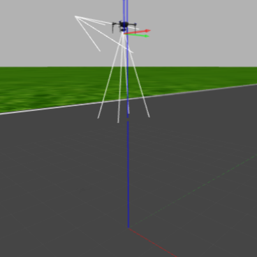
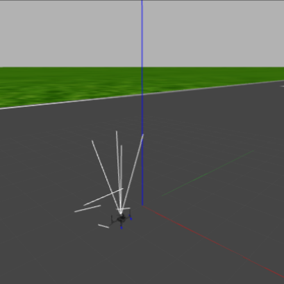
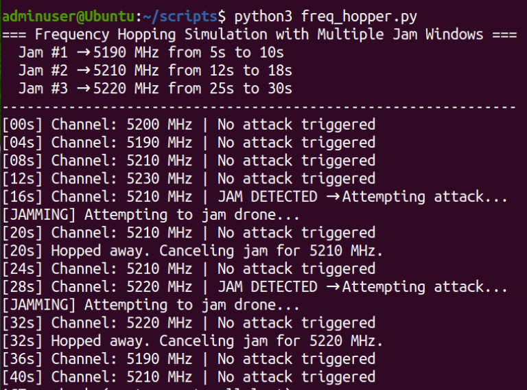
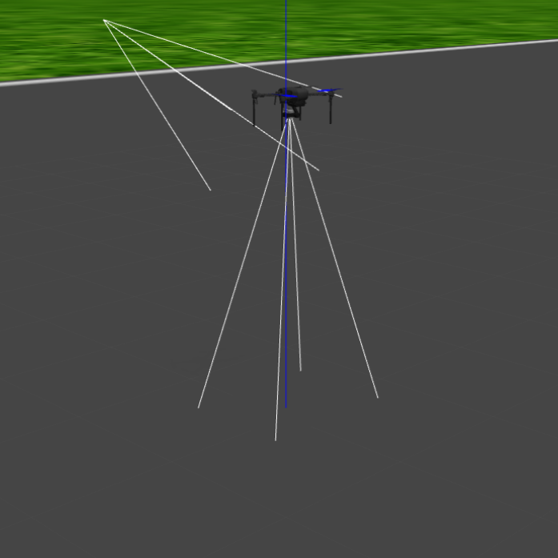
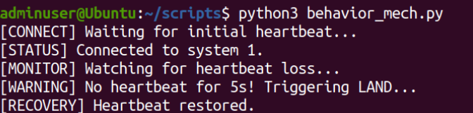
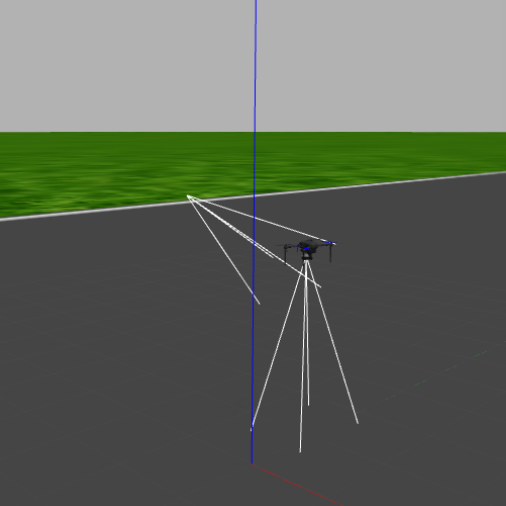
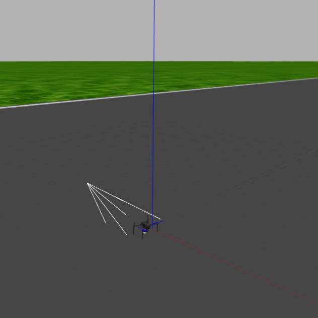

# Drone Security Simulation Project

This repository contains scripts and documentation for a project in **Intro to Computer Security**. Our focus is on exploring vulnerabilities in drone communication systems, specifically RF jamming, and evaluating software-based countermeasures such as frequency hopping and automated drone behaviors during signal loss.

---

## Project Overview

**Course:** Intro to Computer Security  
**Team Name:** Phantom Phishers  
**Goal:** Investigate communication-based attacks on delivery drones and evaluate basic defensive strategies using simulation.

We used the multiUAV Gazebo simulation environment:  
https://github.com/monemati/multiuav-gazebo-simulation  
along with **ArduPilot SITL** and **MAVProxy**.

---

## Simulation Environment Setup

To run a single UAV simulation:

**Terminal 1**
```
cd ~/ardupilot/Tools/autotest
./sim_vehicle.py -v ArduCopter -f gazebo-iris --console -I0
```

**Terminal 2**
```
gazebo --verbose ~/ardupilot_gazebo/worlds/iris_ardupilot.world
```

**Then in MAVProxy console:**
```
mode guided
arm throttle
takeoff 5
```

---

## Simulations

### Simulation 1: RF Jamming Attack (No Defense)

A jamming event is simulated by pausing SITL mid-flight. The drone loses communication and becomes unresponsive.

**Before Jam**  


**After Jam**  


---

### Simulation 2: Frequency Hopping (Defense Script)

A custom frequency hopping script switches communication channels every few seconds. Jamming attempts are scheduled on specific channels. If the drone avoids the jammed channel in time, the attack is canceled.

**Hopping Log**  


**Drone Surviving Jam**  


---

### 🧠 Simulation 3: Drone Response to Signal Loss (Behavior-Based)

A custom script monitors MAVLink heartbeats. If connection is lost for 5 seconds, it issues a `LAND` command to ensure the drone safely descends without crashing.

**Script Detects Signal Loss**  


**Drone Landing After Attack**  
 

---

## Repository Structure

```
scripts/       - Python scripts for jamming, frequency hopping, behavior control  
images/        - Screenshots for documentation and presentation  
README.md      - Project summary and setup instructions
```

---

## Team Members

Tommy Baratta  
Allison Brown  
Andrea Safadi  
Vesper Nguyen  
Zander Picon  

---

## Notes

All experiments were run in a virtual simulation environment using SITL and Gazebo. No real drone hardware was used.  
This project is intended for academic purposes and supports our exploration of secure communication in hybrid drone delivery systems.

